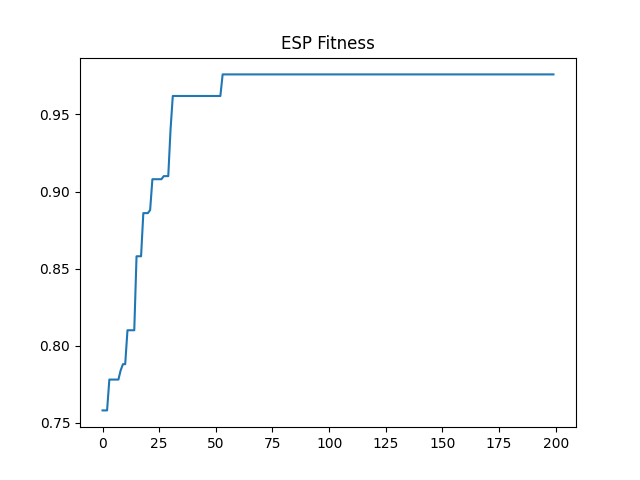

# ESP - Endosymbiotic Predation for AI

Models compete and digest each other like mitochondria did.

**Result:** Fast capability jump + RSI seed.

Paper: paper.md  
Sim: sim.py (numpy only)

Run:
pip install numpy matplotlib
python3 sim.py

ITS ALIVE ⚓
